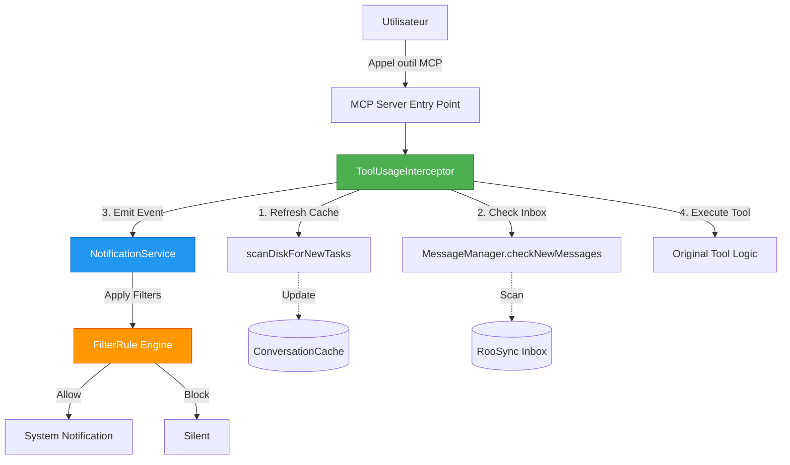

# Système de Notifications Push MCP - Architecture Event-Driven

**Version:** 1.0.0  
**Date:** 2025-10-19  
**Statut:** Production Ready  

---

## 📋 Table des Matières

1. [Vue d'Ensemble](#vue-densemble)
2. [Architecture Technique](#architecture-technique)
3. [Configuration](#configuration)
4. [Guide d'Utilisation](#guide-dutilisation)
5. [Exemples d'Utilisation](#exemples-dutilisation)
6. [Troubleshooting](#troubleshooting)
7. [API Reference](#api-reference)

---

## 🎯 Vue d'Ensemble

### Objectif

Le système de notifications push permet de déclencher automatiquement des notifications lors de l'utilisation de **n'importe quel outil MCP**, offrant ainsi :

- ✅ **Indexation automatique** des nouvelles conversations
- ✅ **Vérification inbox RooSync** pour nouveaux messages
- ✅ **Filtrage intelligent** via règles configurables (firewall-like)
- ✅ **Notifications système** (Windows/macOS) selon priorité

### Principes de Design

- **Non-intrusif** : N'affecte jamais l'exécution des outils
- **Asynchrone** : Opérations en arrière-plan (<100ms)
- **Configurable** : Règles de filtrage flexibles
- **Observable** : Pattern Observer pour extensibilité

---

## 🏗️ Architecture Technique

### Diagramme d'Architecture



### Composants Principaux

#### 1. **NotificationService.ts**

**Rôle** : Gestion centralisée des notifications avec pattern Observer

**Responsabilités** :
- Enregistrer des listeners (`subscribe`)
- Filtrer les événements via règles configurables
- Émettre des notifications système si pertinent

**Pattern** : Observer + Firewall

```typescript
export class NotificationService {
  private listeners: NotificationListener[] = [];
  private filterRules: FilterRule[] = [];
  
  async notify(event: NotificationEvent): Promise<void> {
    // 1. Appliquer règles de filtrage
    const decision = this.applyFilterRules(event);
    
    // 2. Si autorisé, notifier tous les listeners
    if (decision.action === 'allow' && decision.notifyUser) {
      for (const listener of this.listeners) {
        await listener.onNotification(event);
      }
    }
  }
}
```

#### 2. **ToolUsageInterceptor.ts**

**Rôle** : Intercepter l'usage de tous les outils MCP

**Responsabilités** :
- Wrapper l'exécution d'un outil
- Déclencher indexation via `scanDiskForNewTasks`
- Vérifier inbox via `MessageManager.checkNewMessages`
- Émettre événement notification si pertinent

**Pattern** : Middleware/Decorator

```typescript
export class ToolUsageInterceptor {
  async interceptToolCall(
    toolName: string,
    args: any,
    execute: () => Promise<any>
  ): Promise<any> {
    try {
      // 1. Refresh cache (si activé)
      if (this.config.refreshCache) {
        await scanDiskForNewTasks(this.conversationCache, 'auto');
      }
      
      // 2. Check inbox (si activé)
      if (this.config.checkInbox) {
        const newMessages = await this.messageManager.checkNewMessages(
          this.config.machineId
        );
        
        // 3. Émettre notification si messages pertinents
        if (newMessages.length > 0) {
          await this.notificationService.notify({
            type: 'new_message',
            source: 'roosync_inbox',
            priority: this.calculatePriority(newMessages),
            payload: { count: newMessages.length, messages: newMessages },
            timestamp: new Date().toISOString()
          });
        }
      }
      
      // 4. Exécuter l'outil original (JAMAIS bloqué)
      return await execute();
    } catch (error) {
      console.error('❌ [Interceptor] Error:', error);
      // CRITIQUE: Toujours exécuter l'outil même en cas d'erreur
      return await execute();
    }
  }
}
```

#### 3. **MessageManager.checkNewMessages()**

**Rôle** : Wrapper simplifié pour vérifier l'inbox RooSync

**Implémentation** :

```typescript
// src/services/MessageManager.ts
async checkNewMessages(machineId: string): Promise<MessageListItem[]> {
  console.error('🔔 [MessageManager] Checking for new messages for:', machineId);
  return await this.readInbox(machineId, 'unread');
}
```

**Performance** : <50ms (lecture JSON légère)

---

## ⚙️ Configuration

### Variables .env

```bash
# =============================================================================
# NOTIFICATIONS PUSH CONFIGURATION
# =============================================================================

# Active/désactive le système de notifications push
# Valeurs: true | false
NOTIFICATIONS_ENABLED=true

# Active/désactive la vérification automatique de l'inbox RooSync
# Valeurs: true | false
NOTIFICATIONS_CHECK_INBOX=true

# Priorité minimale pour déclencher une notification système
# Valeurs: LOW | MEDIUM | HIGH | URGENT
NOTIFICATIONS_MIN_PRIORITY=HIGH

# Chemin vers le fichier de configuration des règles de filtrage
# Chemin relatif depuis le répertoire du MCP
NOTIFICATIONS_FILTER_CONFIG=./config/notification-filters.json
```

### Fichier de Règles de Filtrage

**Chemin** : `config/notification-filters.json`

**Format** :

```json
{
  "version": "1.0.0",
  "rules": [
    {
      "id": "urgent-messages-only",
      "description": "Autorise uniquement les messages URGENT à déclencher des notifications",
      "eventType": "new_message",
      "condition": {
        "priority": ["URGENT"]
      },
      "action": "allow",
      "notifyUser": true
    },
    {
      "id": "block-low-priority",
      "description": "Bloque les messages de priorité LOW pour éviter le spam",
      "eventType": "new_message",
      "condition": {
        "priority": ["LOW"]
      },
      "action": "block",
      "notifyUser": false
    }
  ],
  "defaultAction": "allow",
  "defaultNotifyUser": false
}
```

**Types de Règles** :

| Type Événement | Description | Conditions Disponibles |
|----------------|-------------|------------------------|
| `new_message` | Nouveau message RooSync | `priority`, `tags`, `source` |
| `decision_pending` | Décision en attente d'approbation | `priority`, `type` |
| `tool_used` | Outil MCP utilisé | `sourceTool`, `priority` |

**Actions** :

- `allow` : Autorise l'événement à déclencher une notification
- `block` : Bloque l'événement (silencieux)
- `require_approval` : Demande approbation utilisateur (future feature)

---

## 📖 Guide d'Utilisation

### Activation du Système

1. **Vérifier la configuration .env**

```bash
cd mcps/internal/servers/roo-state-manager
cat .env | grep NOTIFICATIONS
```

2. **Créer/Modifier les règles de filtrage**

```bash
# Éditer le fichier de règles
code config/notification-filters.json
```

3. **Redémarrer le MCP**

```bash
npm run build
# Puis redémarrer Roo-Code ou toucher mcp_settings.json
```

### Désactivation Temporaire

**Option 1** : Désactiver complètement

```bash
# Dans .env
NOTIFICATIONS_ENABLED=false
```

**Option 2** : Désactiver uniquement inbox

```bash
# Dans .env
NOTIFICATIONS_CHECK_INBOX=false
```

### Ajuster le Seuil de Priorité

```bash
# Dans .env
NOTIFICATIONS_MIN_PRIORITY=URGENT  # Seulement URGENT
NOTIFICATIONS_MIN_PRIORITY=HIGH    # HIGH et URGENT
NOTIFICATIONS_MIN_PRIORITY=MEDIUM  # MEDIUM, HIGH et URGENT
NOTIFICATIONS_MIN_PRIORITY=LOW     # Tous les messages
```

---

## 💡 Exemples d'Utilisation

### Cas d'Usage 1 : Notifications Urgentes Uniquement

**Besoin** : Recevoir uniquement les messages critiques

**Configuration** :

```json
{
  "rules": [
    {
      "id": "urgent-only",
      "eventType": "new_message",
      "condition": { "priority": ["URGENT"] },
      "action": "allow",
      "notifyUser": true
    },
    {
      "id": "block-all-other",
      "eventType": "new_message",
      "condition": { "priority": ["LOW", "MEDIUM", "HIGH"] },
      "action": "block",
      "notifyUser": false
    }
  ]
}
```

### Cas d'Usage 2 : Notifications Silencieuses

**Besoin** : Indexer les messages mais sans notification système

**Configuration** :

```json
{
  "rules": [
    {
      "id": "silent-indexing",
      "eventType": "new_message",
      "condition": { "priority": ["LOW", "MEDIUM", "HIGH", "URGENT"] },
      "action": "allow",
      "notifyUser": false
    }
  ]
}
```

### Cas d'Usage 3 : Filtrage par Source

**Besoin** : Notifier uniquement pour certains outils

**Configuration** :

```json
{
  "rules": [
    {
      "id": "roosync-tools-only",
      "eventType": "tool_used",
      "condition": {
        "sourceTool": ["roosync_compare_config", "roosync_apply_decision"],
        "priority": ["HIGH", "URGENT"]
      },
      "action": "allow",
      "notifyUser": true
    }
  ]
}
```

---

## 🐛 Troubleshooting

### Problème : Aucune Notification Reçue

**Diagnostics** :

1. **Vérifier activation**
   ```bash
   grep NOTIFICATIONS_ENABLED .env
   # Doit afficher: NOTIFICATIONS_ENABLED=true
   ```

2. **Vérifier les logs du serveur**
   ```bash
   # Rechercher dans les logs VS Code
   🔔 [MessageManager] Checking for new messages for: myia-po-2023
   ```

3. **Tester manuellement**
   - Créer un message test URGENT dans `${ROOSYNC_SHARED_PATH}/messages/inbox/`
   - Utiliser n'importe quel outil MCP
   - Vérifier les logs

**Solutions** :

- Si `NOTIFICATIONS_ENABLED=false` → Mettre à `true`
- Si pas de logs → MCP n'a pas redémarré → Redémarrer VS Code
- Si logs mais pas de notification → Vérifier règles de filtrage

### Problème : Trop de Notifications

**Symptôme** : Spam de notifications

**Solutions** :

1. **Augmenter le seuil de priorité**
   ```bash
   NOTIFICATIONS_MIN_PRIORITY=URGENT
   ```

2. **Désactiver temporairement**
   ```bash
   NOTIFICATIONS_CHECK_INBOX=false
   ```

3. **Filtrer par source**
   ```json
   {
     "rules": [
       {
         "id": "block-low-medium",
         "eventType": "new_message",
         "condition": { "priority": ["LOW", "MEDIUM"] },
         "action": "block",
         "notifyUser": false
       }
     ]
   }
   ```

### Problème : Performance Dégradée

**Symptôme** : Lenteur lors de l'usage d'outils

**Diagnostics** :

1. **Vérifier temps de scan**
   ```bash
   # Rechercher dans les logs
   ⏱️ [DiskScanner] Scan completed in XXms
   ```

2. **Si > 200ms** → Problème disque ou cache trop large

**Solutions** :

1. **Désactiver refresh cache temporairement**
   - Modifier `src/index.ts` :
   ```typescript
   this.toolInterceptor = new ToolUsageInterceptor(
     // ...
     {
       enabled: true,
       checkInbox: true,
       refreshCache: false, // ← Désactiver
       machineId
     }
   );
   ```

2. **Optimiser cache conversations**
   - Supprimer anciennes conversations
   - Nettoyer répertoire `.tasks/`

### Problème : Erreur au Démarrage

**Symptôme** : MCP ne démarre pas après activation

**Diagnostics** :

```bash
# Vérifier compilation TypeScript
npm run build

# Vérifier erreurs dans mcp_settings.json
code $env:APPDATA\Code\User\globalStorage\rooveterinaryinc.roo-cline\settings\mcp_settings.json
```

**Solutions** :

1. **Recompiler**
   ```bash
   npm run build
   ```

2. **Vérifier dépendances**
   ```bash
   npm install
   ```

3. **Vérifier configuration**
   ```bash
   # Valider JSON
   node -e "console.log(JSON.parse(require('fs').readFileSync('./config/notification-filters.json')))"
   ```

---

## 📚 API Reference

### NotificationEvent

```typescript
interface NotificationEvent {
  type: 'tool_used' | 'new_message' | 'decision_pending';
  source: string;        // Nom de l'outil ou machine ID
  priority: 'LOW' | 'MEDIUM' | 'HIGH' | 'URGENT';
  payload: any;
  timestamp: string;     // ISO 8601
}
```

### FilterRule

```typescript
interface FilterRule {
  id: string;
  description?: string;
  eventType: NotificationEvent['type'];
  condition: {
    sourceTool?: string[];
    priority?: string[];
    tags?: string[];
  };
  action: 'allow' | 'block' | 'require_approval';
  notifyUser: boolean;
}
```

### InterceptorConfig

```typescript
interface InterceptorConfig {
  enabled?: boolean;                           // Activer l'interception
  machineId: string;                          // ID machine courante
  checkInbox: boolean;                        // Vérifier inbox
  refreshCache: boolean;                      // Refresh cache conversations
  minPriority?: 'LOW' | 'MEDIUM' | 'HIGH' | 'URGENT';
}
```

### Méthodes Publiques

#### NotificationService

```typescript
class NotificationService {
  // Enregistrer un listener
  subscribe(listener: NotificationListener): void;
  
  // Émettre une notification (avec filtrage)
  async notify(event: NotificationEvent): Promise<void>;
  
  // Charger règles depuis fichier JSON
  loadFilterRules(rules: FilterRule[]): void;
  
  // Mettre à jour une règle existante
  updateFilterRule(ruleId: string, updates: Partial<FilterRule>): void;
}
```

#### ToolUsageInterceptor

```typescript
class ToolUsageInterceptor {
  // Intercepter l'appel d'un outil
  async interceptToolCall(
    toolName: string,
    args: any,
    execute: () => Promise<any>
  ): Promise<any>;
  
  // Mettre à jour configuration
  updateConfig(config: Partial<InterceptorConfig>): void;
}
```

---

## 🔒 Contraintes et Limites

### Contraintes Techniques

| Contrainte | Valeur | Justification |
|------------|--------|---------------|
| **Performance** | <100ms | Ne pas bloquer l'exécution des outils |
| **Timeout Inbox** | 5s max | Échec silencieux si réseau lent |
| **Cache Refresh** | Async | Non-bloquant pour l'utilisateur |
| **Erreurs** | Jamais bloquer | L'outil doit toujours s'exécuter |

### Limites Connues

1. **Pas de retry automatique** : Si l'inbox check échoue, pas de nouvelle tentative
2. **Notifications Windows uniquement** : macOS non testé
3. **Pas de queue de notifications** : Si >10 messages URGENT simultanés, certains peuvent être ignorés
4. **Pas de persistance d'état** : Redémarrage MCP = perte historique notifications

### Recommandations

- ✅ **Ne jamais activer `refreshCache` si >1000 conversations**
- ✅ **Limiter règles de filtrage à <50 règles** (performance)
- ✅ **Utiliser priorité HIGH minimum** pour éviter spam
- ✅ **Tester en local avant production**

---

## 📝 Changelog

### Version 1.0.0 (2025-10-19)

**Ajouté** :
- ✨ `NotificationService.ts` avec pattern Observer
- ✨ `ToolUsageInterceptor.ts` avec hook lifecycle MCP
- ✨ `MessageManager.checkNewMessages()` wrapper
- ✨ Intégration dans `src/index.ts`
- ✨ Configuration `.env` complète
- ✨ Fichier de règles de filtrage JSON

**Documentation** :
- 📚 Guide d'architecture détaillé
- 📚 Guide d'utilisation complet
- 📚 Troubleshooting exhaustif

---

## 🤝 Contribution

Pour contribuer à ce système :

1. **Ajouter de nouveaux types d'événements** :
   - Modifier `NotificationEvent['type']`
   - Documenter dans API Reference

2. **Ajouter de nouveaux listeners** :
   ```typescript
   notificationService.subscribe({
     onNotification: async (event) => {
       // Votre logique personnalisée
     }
   });
   ```

3. **Proposer de nouvelles règles de filtrage** :
   - Créer un PR avec nouveau preset dans `config/`

---

## 📞 Support

**Questions** : Créer une issue GitHub  
**Bugs** : Rapport détaillé avec logs et configuration  
**Améliorations** : Pull Request bienvenue

---

**Maintenu par** : Roo State Manager Team  
**Dernière mise à jour** : 2025-10-19